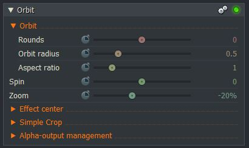

*[[Return to parent page]](../../../README.md)*  

# Orbit

### *Filename:* <a href="Orbit.fx" download>Orbit.fx</a> 
[Download as zip-file](Orbit.zip)

*Category:* **DVE**  
*Subcategory:* **DVE Extras**  
*Status:* **Second prototype** of 17 Dec 2018, (minor code changes on 19 June 2019)  

### *Known issues and limitations:*
- With negative zoom (minimization),the default setting Orbit Radius refers to the outer edges of the foreground. 
  This ensures that zooming in does not affect the visibility of the foreground object. 
  The side effect is that at 0% zoom, no position change takes place.  
- Crop: In case of asymmetrical cropping, the spin center is not centered correctly.  

--------------------------------------------------------------------------

### *Effect description:*
The `Rounds` slider lets the minimized foreground texture circle around the set `Effect center`.  
(only 2D)  
`Spin` enables a self-rotation of the foreground.  
  
<a href="https://www.lwks.com/index.php?option=com_kunena&func=view&catid=6&id=190102&limit=15&limitstart=15&Itemid=81#190202"  target="blank">Tests with this effect and previous prototypes.</a>  

------------------------------------------------------------------------

### *Effect development, suggestions for improvement (not yet implemented):*
- Add a selection box to pin the frame at it’s center or one of it’s corners to the circle.
- Crop: In case of asymmetrical cropping a re-centering of the spin is required. 
        Perhaps it makes more sense to remove the Crop feature, 
        so that the user can connect an additional effect to the input according to the requirements?
- Aspect Ratio of Orbit: 
  - Symmetric Slider Scaling  
  - Maybe rotatable aspect ratio?  
- Interference filter option at minimization (scaling-dependent pre-blurring).  
- Edges of the foreground texture: Ideas for code optimizations see the comments in the effect code itself.  
- Maybe add a 3D orbit?  
