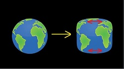
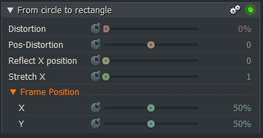

*[[Return to parent page]](../../../README.md)*  

# From circle to rectangle

### Filename: <a href="CircleToRectangle.fx" download>CircleToRectangle.fx</a> 
[Download as zip-file](CircleToRectangle.zip)

*Category:* **Stylize**  
*Subcategory:* **Distortion**  
*Status:* **Prototype** , June 2019  
<a href="https://www.lwks.com/index.php?option=com_kunena&func=view&catid=6&id=199747&limit=15&limitstart=15&Itemid=81#199837"  target="blank">See the previous tests of this effect under a different effect name</a> 

--------------------------------------------------------------------------

### Effect description:
  
This simple effect stretches the texture in the upper and lower areas. The strength of this stretching increases with the vertical distance from the center. This center can be moved vertically with `Pos-Distortion`.
This effect was developed for material where the circle is already cropped up and down (perhaps from the smartphone camera or another effect). 
If not cropped then the corners, as well as the top and bottom edges remain rounded.

To adapt the visible dimensions to the export aspect ratio, the entire texture can be stretched horizontally, or mirrors can be moved.  

If black edges are to remain on the sides, then horizontal cropping could be useful to create absolutely straight edges. If this is desired, this could be easily programmed. At the moment you would need a separate effect for cropping.

