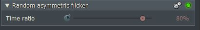
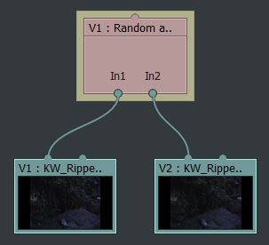

*[[Return to parent page]](../../../README.md)*  

# Random asymmetric flicker

### *Filename:* <a href="RandomFlickerB1.2.fx" download>Orbit.fx</a> 
[Download as zip-file](RandomFlickerB1.2.zip)

*Category:* **User**  
*Subcategory:* **Switches**  
*Status:* **Second prototype** of 01 July 2019  

--------------------------------------------------------------------------

### Effect description: 
Does a pseudo random switch between two inputs.  
In the standard setting, very short hold times on the second input (often only one frame).   
  
`Time ratio`(adjustable asymmetry):  
0%: Track V1 and V2 (Input 1 and 2) will be used 50% of the time (statistically)  
-100%: Almost only input 2  
+100%: Almost only input 1  
  
At 0% is the most switched.  
At near + -100% only rarely.  
  
  
  
<a href="https://www.lwks.com/index.php?option=com_kunena&func=view&catid=7&id=200836&Itemid=81" target="blank">Tests with this effect and previous prototypes.</a>  

If you need longer hold times on both inputs, please use the standard `Random flicker` effect from the standard library.
