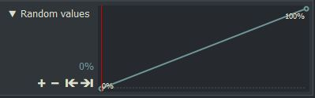

*[[Return to parent page]](../README.md)*  

## More details (Camera shake & crop & reflections)
  

---------------------------------------------

### Strength:

  - **Move**  
    Average strength of semi-random shaking movements. 
  - **Automatic**  
  Self-adjusting zoom, depending on the "Move" setting and automatic mode.  
    
    - **Mirrored edges (no zoom)**  
      The edges are reflected to avoid trembling black edges. 
    - **Zoom; mirrored edges visible**  
      Self-adjusting low zoom to minimize reflections at the edges.
    - **Zoom; mirrored edges maybe visible**  
      Self-adjusting zoom to largely avoid reflections at the edges.
    - **Secure zoom; edges never visible**  
       Self-adjusting zoom, which can be strong depending on the "Move" setting.  
  - **XY Shake ratio**  
    - 0% = Statistically identical average intensity of horizontal and vertical movements.
    - -100% = Horizontal movements only.
    - +100% = Vertical movements only.

---------------------------------------------

#### Speed
  - Average shaking frequency.

---------------------------------------------

### Crop & mirror edges
  
The main purpose of this feature is to prevent the shaking of black areas of letterbox material. This feature is useful when the visible frame dimensions differ from the actual frame dimensions.In addition, the behavior can also be changed for other purposes.   
  - **Crop and mirror behavior:**  
  If you have set "Top & Bottom" and "Left & Right" to 0, then the behavior set here is without meaning.
    
    - **Reflection on set edges acting on incoming frames**  
      Designed to use letterbox material or the like with visible edges.  
      Please first set "Move" to 0% to see the incoming original frame.  
     Then set "Top & Bottom" or "Left & Right" so that this cropping completely covers the original edges. 
     If you temporarily change the crop color, this makes adjustment easier.  
     After this basic adjustment, you can set the "Move" slider to any value.   
    - **Reflection on the edges of the incoming frame**  
      Use this setting if your original material has no visible edges and you want to crop it.  
      Because the reflections at the edges of the original frame take place in this setting, 
      these reflections are further away from the cropped edges,
      which minimizes the likelihood of their visibility while shaking.  
    - **NO cropping ; Reflection on the set edges**  
     It is reflected at the set edges. Because it is not cropped, these reflections are clearly visible.  
     This may be used in some cases to remove borders from the original material, or when such special effects are desired.   
  - **Top & Bottom**
    Vertical cropping
  - **Left & Right**
     Horizontal cropping
  - **Crop color**
    Color and alpha of the cropped areas. 
    
--------------------------------------------
    
#### Random values
They are not real random values.  
From this ramp, the effect creates seemingly random values to produce the shaking.
  
The values of this ramp itself are **not** the random values, but merely the basis for selecting an internal random value.
If you want to start the effect with other shaking behaviors then you can change the starting value of the keyframing (ramp). 
Note that the angle of the ramp also affects the speed. If you just want to change the speed then use the "Speed" slider.
