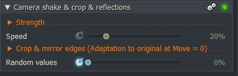
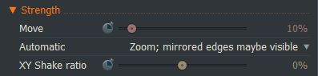
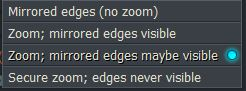
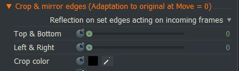
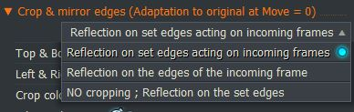

*[[Return to parent page]](../README.md)*  

## More details (Camera shake & crop & reflections)
  

---------------------------------------------

### Strength: 

  - **Move**  
    Details in progress  
  - **Automatic**  
  
    - **Mirrored edges (no zoom)**  
      Details in progress
    - **Zoom; mirrored edges visible**  
      Details in progress
    - **Zoom; mirrored edges maybe visible**  
      Details in progress
    - **Secure zoom; edges never visible**  
       Details in progress
  - **XY Shake ratio**  
    Details in progress

---------------------------------------------

#### Speed
  - Details in progress

---------------------------------------------

### Crop & mirror edges
  
  -**Crop and mirror behavior:**  
    
    - **Reflection on set edges acting on incoming frames**  
      Details in progress
    - **Reflection on the edges of the incoming frame**  
      Details in progress
    - **NO cropping ; Reflection on the set edges**   
      Details in progress
  - **Top & Bottom**
    Details in progress
  - **Left & Right**
     Details in progress
  - **Crop color**
    Details in progress  
    
    --------------------------------------------
    
#### Random values
Generating the apparent random values to produce the shaking.  
They are not real random values.  
If you want to start the effect with other shaking behaviors then you can change the starting value of the keyframing (ramp). 
Note that the angle of the ramp also affects the speed. If you just want to change the speed then use the "Speed" slider.
