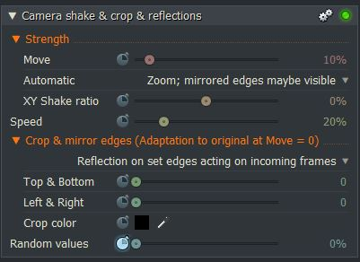

*[[Return to parent page]](../README.md)*  

# Camera shake & crop & reflections

### Filename: <a href="Camera_shake_crop.fx" download>Camera_shake_crop.fx</a> 
[Download as zip-file](Camera_shake_crop.zip)

*Category*: **Stylize**  
*Subcategory:* **Video artefacts**  
*Status:* **Prototype** ,  June 2019  

### *Known issues and limitations:*
  - **Only for Windows**  
  -  Maybe the effect doesn't work with all GPUs?
  - **Lightworks 14.5 or better**  

--------------------------------------------------------------------------

### Effect description:
Horizontal and vertical shifts based on a random generator.  

#### Features:
- Several automatic zoom modes to avoid the visibility of the frame edges.  
- Different reflection modes of the edges to allow a low zoom at strong shifts.  
- Cropping for adaptation to letterbox material.  
  By default, the original material is reflected at the set crop edges before cropping is applied. 
  This prevents the black edges of letterbox material from becoming visible when shaking.  
    
  ### [More details](Details.md) 
